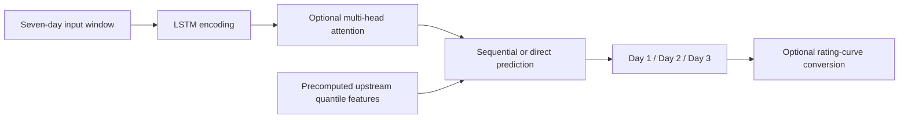

<div align="center">

# SeqLSTM-MHA
### One to three-day ahead hydrological forecasting

[](https://doi.org/10.1029/2025WR042482)
[](https://doi.org/10.1029/2025WR042482)
[](https://pytorch.org/)

**[Read the paper](https://doi.org/10.1029/2025WR042482) · [Training guide](docs/TRAINING.md) · [Model configurations](src/configs)**

</div>

## Paper

**One to Three-Day Lead Streamflow Forecast Using Multi-Head Attention With Long Short-Term Memory in Reservoir Regulated Catchment**

Hiren Solanki, A. S. Aravinthakshan, Sayuj Gupta, and Vimal Mishra

*Water Resources Research*, **62**(8), e2025WR042482 · Published August 6, 2026

The study forecasts water level and streamflow in the reservoir-regulated Narmada basin. Sequential forecasting, upstream information, and temporal attention help capture flood magnitude and timing across longer lead times.

## Published results

Highlights from the [paper abstract](https://doi.org/10.1029/2025WR042482). NSE is Nash–Sutcliffe efficiency; higher is better.

| Measure | One-day lead | Three-day lead |
| :--- | ---: | ---: |
| Water-level NSE | 0.85 | 0.81 |
| Streamflow NSE | 0.74 | 0.71 |

| Extreme-event measure | Reported result |
| :--- | :--- |
| Extreme-event NSE | > 0.6 |
| Peak streamflow captured in events above the 95th percentile | > 80% |

## Implementation at a glance

This repository contains a config-driven PyTorch framework for comparing LSTM forecasting variants. The default branch is `main`; the historical repository name is `srip-transformer`.



*Conceptual overview of the repository modules; see the paper for the research methodology.*

| Component | Configuration | Purpose |
| :--- | :--- | :--- |
| Sequential prediction | `sequential` | Feed earlier predictions into later forecast stages |
| Multi-head attention | `use_attention` | Weight encoded temporal information |
| Hierarchical features | `use_hierarchical` | Incorporate precomputed quantile features |
| Rating curve | `use_fitter` | Water-level-to-streamflow conversion for streamflow targets |
| Bidirectional encoder | `bidirectional` | Compare against a bidirectional LSTM |

The batch runner selects **seven configurations across seven bundled station CSVs** (49 experiments). The paper describes eight gauging stations; the bundled training suite should not be interpreted as the complete paper dataset. See [the full guide](docs/TRAINING.md) for data columns, splits, and configuration details.

## Quick start

From a Python environment compatible with the packages in `requirements.txt`:

```bash
git clone https://github.com/aravinthakshan/srip-transformer.git
cd srip-transformer
python3 -m venv .venv
source .venv/bin/activate
python -m pip install -r requirements.txt
```

For Windows PowerShell, activate with `.venv\Scripts\Activate.ps1`. The trainer uses CUDA when available and otherwise CPU. Requirements specify minimum versions rather than a pinned environment.

### Train one station

```bash
python src/train.py \
  --config src/configs/full.yaml \
  --station hierarchial/new_Handia_with_hierarchical_quantiles.csv \
  --target streamflow_final
```

Use `--target waterlevel_final` for water-level forecasting. The directory spelling `hierarchial/` matches the repository.

### Preview or run the ablation suite

```bash
python run_all.py --dry-run
python run_all.py
```

The batch runner defaults to streamflow. To train water-level models, invoke `src/train.py` with the target explicitly. Shared training settings are defined in [`src/utils.py`](src/utils.py): seven-day lookback, batch size 256, 30 epochs, Adam at 0.001, and seed 74.

### Compare trained runs

```bash
python src/evaluate.py \
  --compare "runs/baseline_*" "runs/seq_*" "runs/full_*" \
  --output comparison.csv \
  --plots \
  --output_dir ablation_plots
```

Generated runs contain model weights, metrics, and analysis outputs. Evaluation includes NSE, KGE, R², PBIAS, RMSE, MAE, extreme-flow NSE, and peak capture. [The training guide](docs/TRAINING.md) also covers feature importance and model complexity.

## Repository map

| Path | Contents |
| :--- | :--- |
| [`src/models/`](src/models) | Model components and composition |
| [`src/configs/`](src/configs) | YAML ablation configurations |
| [`src/train.py`](src/train.py) | Single configuration / station training |
| [`run_all.py`](run_all.py) | Batch experiment runner |
| [`src/evaluate.py`](src/evaluate.py) | Metrics comparisons and plots |
| [`hierarchial/`](hierarchial) | Seven station CSVs with quantile features |
| [`stations_csvs/`](stations_csvs) | Additional station CSVs |
| [`docs/TRAINING.md`](docs/TRAINING.md) | Detailed setup, outputs, and troubleshooting |

## Citation

```bibtex
@article{solanki2026streamflow,
  title   = {One to Three-Day Lead Streamflow Forecast Using Multi-Head Attention With Long Short-Term Memory in Reservoir Regulated Catchment},
  author  = {Solanki, Hiren and Aravinthakshan, A. S. and Gupta, Sayuj and Mishra, Vimal},
  journal = {Water Resources Research},
  year    = {2026},
  volume  = {62},
  number  = {8},
  pages   = {e2025WR042482},
  doi     = {10.1029/2025WR042482},
  url     = {https://doi.org/10.1029/2025WR042482}
}
```
